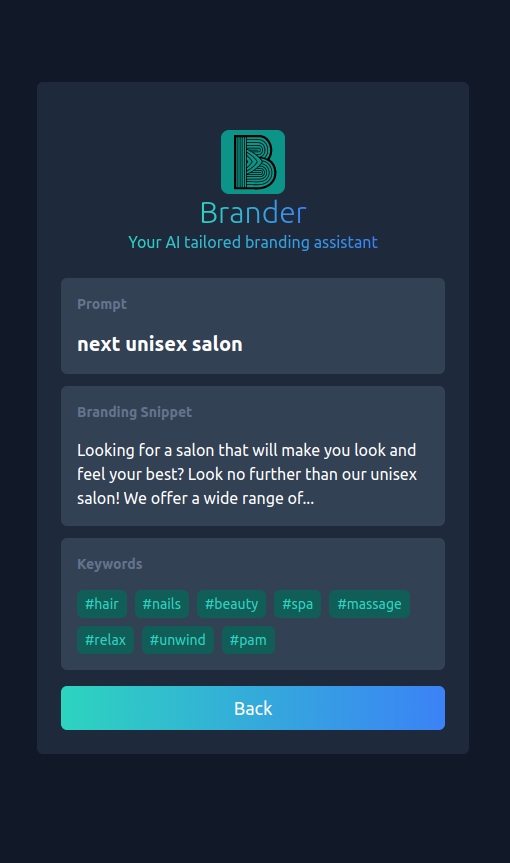

# Brander App: Portfolio Project

This is a SaaS application that generates AI branding snippets and keywords for the customer's brand.
It is a full stack application, and created to illustrate how to create AI driven full-stack
SaaS apps.

## Examples

Try out the demo here: https://mybrander.vercel.app/

## Tech Stack

#### Backend Stack

| Type      | Tech                                                                                                     |
| --------- | -------------------------------------------------------------------------------------------------------- |
| Language  | [Python](https://www.python.org/)                                                                        |
| Framework | [FastAPI](https://fastapi.tiangolo.com/)                                                                 |
| Hosting   | [AWS](https://aws.amazon.com/) (Lambda + API Gateway)                                                    |
| Other     | [OpenAI](https://openai.com/), [AWS CDK](https://aws.amazon.com/cdk/), [Docker](https://www.docker.com/) |

#### Frontend Stack

| Type      | Tech                                                          |
| --------- | ------------------------------------------------------------- |
| Language  | [Typescript](https://www.typescriptlang.org/)                 |
| Framework | [NextJS](https://nextjs.org/) / [React](https://reactjs.org/) |
| Styling   | [TailwindCSS](https://tailwindcss.com/)                       |
| Hosting   | [Vercel](https://vercel.com)                                  |
